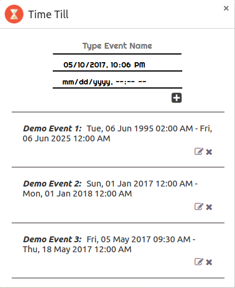
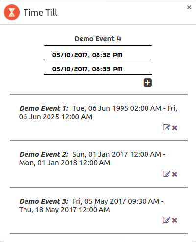

### Description
A chrome extension for setting countdown timer for events and showing the timers in **newtab** page. Using this, users should be able to manually input event dates ~~and also link events from services e.g. Google Calendar~~.
(It seems that it is not possible to integrate Google Calendar API in the extension unless it is published.
Because the webstore URL of the extension is needed for generating OAuth Client ID.)

### Motivation
I needed a countdown timer for events to remind me about upcoming events i.e. Assignment Deadlines, Birthdays etc. Some might argue a installing a mobile app would have been easier, but I spend most of my awake time on my laptop using browser and other applications rather than on mobile. So building a browser extension was the more suitable solution for my need. Moreover, I wanted to brush up my JS knowledge. :smile:

### Installation
Go to ***releases*** page and download the latest release in either zip or gzipped format. Next, extract it in a directory. Then start Chrome browser and go to **extensions** page. Select **Developer Mode** and then click on *Load unpacked extension...*. When directory chooser dialog appears, choose the directory where you cloned the repository. **That's it!**

### Screenshots

### Contributing
To contribute to this repository with features, fork it, create new branch, add your feature and create pull-request. To report bugs or new features, create an issue using the **Issues** tab.
